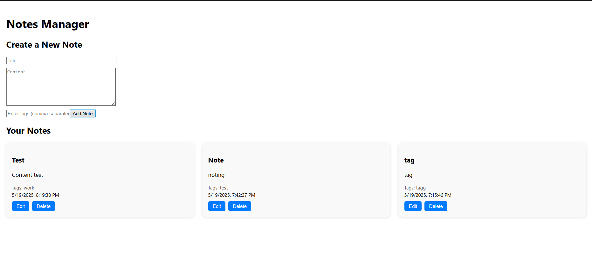

# 📝 Personal Notes Manager

A full-stack MERN application to create, edit, and delete personal notes. Notes are displayed in a clean, responsive card layout with support for tags and timestamps.

---

## 🚀 Features

- ✅ Create new notes with title, content, and tags
- ✏️ Edit existing notes inline
- 🗑️ Delete notes
- 🧠 Tag support (comma-separated)
- 📅 Timestamps for created notes
- 💡 Responsive layout (3 cards per row)

---

## 🛠️ Tech Stack

### Frontend
- React
- Axios
- CSS (custom styles)

### Backend
- Node.js
- Express.js
- MongoDB with Mongoose

---

## 📸 Screenshots

---

## 📂 Project Structure

personal-notes-manager/
├── backend/
│   ├── models/
│   ├── .env
│   ├── server.js
├── frontend/
│   ├── src/
│   │   ├── components/
│   │   │   ├── NoteForm.js
│   │   │   ├── NotesList.js
│   ├── App.js
│   ├── index.js
